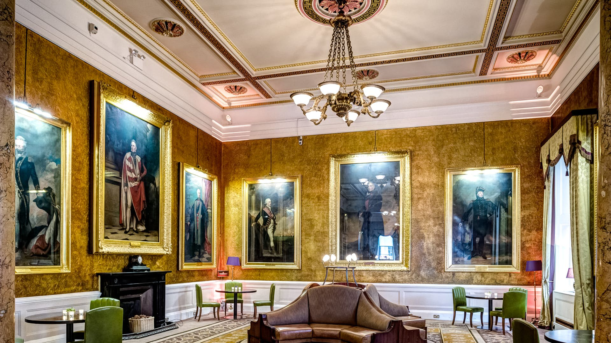

theme: Ostrich
footer: 
autoscale: true

## Building Healthy On-call Cover

# 

### @emanuil_tolev

^ Community engineer at Elastic.
^ It makes high quality tools that make ops less painful. Many are completely free for company and personal use without hooks or trial periods.

---

# This is a talk about negotiation.

### And a little bit of ops.

---

## Agency life @ Cottage Labs LLP

^ university, open science (open access)
^ freelancing
^ started helping run in May 2014

---

## Two clients, 4 years, 24/7 on-call

^ On-call for 4 years at a non-profit and 3 years 3 months at a startup. They overlapped completely.

---

## Non-profit

---

## The setup

- Python app backed by Elasticsearch
- At first only ops person, later 2.
- Docs, arch diagrams, decision context. Playbooks for incidents.

^ I should tell you about the basics since this is a talk on how to build on-call. But let me tell you now - it's not about the tools.
^ 24/7 cover. Python app. 1 app server, 1 bg jobs server, 3-6 Elasticsearch nodes at different times. Newrelic Lite (Free) to monitor in-depth.
^ Only person on call until a junior (at the time) employee joined.
^ Documentation for the system like arch diagrams and docs explaining the setup and context behind old decisions.
^ Playbooks for incidents.

---

## 24/7 - I felt like £1,100/mo was enough for anything.

^ I felt like £1,100 per month was a lot of money. It's not. Depends on case, but time on call is work time. Charge for it appropriately. If they can't afford it, they don't need it - nothing wrong with that.
^ I wanted to give them as much as possible.
^ There's no upper limit on "as much as possible".

---

## Paid to sit around unless phone rings! (or is it?)

^ I thought of it as being paid to sit around and not do much.
^ Can't get on a plane
^ Can't go into a cinema
^ Can't drink beyond 1 light beer
^ Have to stop mid-dinner or in the middle of having a good time and fix site.

---

## Sept 2017. Brick wall.

---

## Employee taking over.

### Conscientious. Sometimes anxious about work quality.
### I had to do something.

---

### Face to face client meeting.

---

# 

---

### "This is a bit of a thorny topic. Do you really need 24/7 cover?"
#### "It's not sustainable for us."
#### "It's not the rate, although that is below market. We would rather provide office hours support if that's OK with you."

---

## Back and forth

- What would it mean in practice?
- Will the site be down for many hours?
- We're getting less cover at the same price point. Can you help us understand that?

^ Not much changes in practice, just when we respond.
^ Down for many hours? Possibly, but everything is a risk trade-off. What does the trade-off cost in this case?
^ The rub: We're not willing to do this anymore.

---

### "That makes sense. We want this work relationship to be sustainable and good for everyone. We're OK with the elevated risk of long downtime outside UK office hours."

#### "We want to thank Cottage Labs for your dedication the past few years."

^ And I want to thank Infrastructure Services For Open Access, stewards of doaj.org , for understanding.
^ As far as I understand the agreement is still in place.

^ These were text-heavy slides. Generally a no-no, I want you and anyone who reads this to know that this kind of work relationship is healthy, good, but most of all - possible.
^ If you're not being treated like this, seek new clients or a new workplace ASAP. Much more remote work and healthy culture is available nowadays than a few years ago.

<!-- TODO: insert slides on Kudos here when the talk is more than 20 min. -->

---

# Lessons

## The approach towards a healthy culture

- Reflect on how things feel. Regularly (1 or 3 months). Read previous reflections after producing a new one.
- Keep team mates in the loop about how you feel.
- Take decisions on actions as early as reasonably possible. When?

^ Team mates: other ppl doing dev
^ When? When you feel certain things should change and can't go on as they have.

---

## This has been a talk about negotiation.
### Let's talk about you.

---

## What are your values?

---

## Think of asking your boss for temporarily reduced hours due to tension and stress.

^ Raise your hand if you thought 'hahah, lol'.
^ It's often thought of as a not serious enough reason. You're not physically injured.
^ But this makes no sense in a knowledge work environment. The impact of those things *on your work* and on you is very real and immediate.

---

## Now think of asking for a raise.

^ You deliver value and this value goes up with time and experience.
^ Try to separate 'am I valuable as a person' from 'the value the company receives under this particular labour agreement'.

---

## Trust yourself.

^ You have to learn to do this, including any mistakes and times when you will accidentally deliver less value to your employer than you're being paid for.
^ This is both so you can stay well and so you can deliver far more value than your salary on many more days than your bad ones.

---

## You are not your work.

^ You've got worth beyond a given situation, position, company and career.
^ This helps stay calm when negotiating.

---

## The personal cost of excellence at work

^ Burnout, lower lifetime earnings due to not negotiating a raise or better title will be yours to keep. Your company, your boss and your colleagues won't be affected at all.

---

## Many ways to achieve excellence.
### Some are sustainable.
### Negotiate towards those paths.

---

## Thank you!

@emanuil_tolev
etolev@elastic.co
